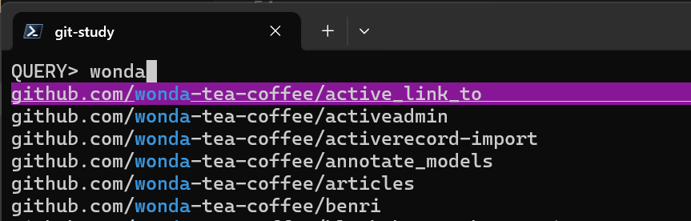
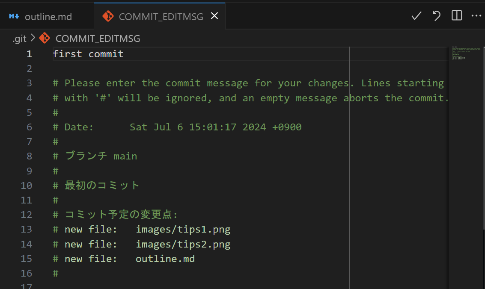

# Git勉強会

---

## バージョン管理入門

---

### なぜバージョン管理をするのか

- 変更を追跡できる: 誰が、いつ、何を変更したかを記録し、過去のバージョンに戻ることができる。

- バックアップとしての機能: 誤ってファイルを削除したり、壊したりしても、以前のバージョンに簡単に戻すことができる。

- ブランチを利用した開発: 複数の開発者が独立して作業を進め、必要に応じてマージできる。これにより、機能ごとに独立した開発が可能になる。

---

### バージョン管理すべきでないもの

例えば、パスワードといった機密情報はバージョン管理してはいけません。
代わりにGitHub Secrets、AWS SSM Parameter Storeなどの目的に特化した場所に保管しましょう。

これはリポジトリの可視性に依りません。
プライベートなリポジトリであっても、ソースコード流出時の被害を最小限に抑える必要があります。

被害事例: https://www.bbc.com/news/technology-42075306

---

## Git入門

---

### [WIP]用語

- ステージ
- ワーキングツリー

---

### ブランチの操作

- ブランチを切り替える

```sh
$ git switch develop
# または
$ git checkout develop
```

- 新しくブランチを切る

```sh
$ git switch -c fix-bug develop
# または
$ git checkout -b fix-bug develop
```

---

### checkoutとswitchのどちらを使うべきか

ブランチのみを扱う分にはどちらでもいいです。

ただしswitchは実験的なコマンドであるため、その動作は今後変わる可能性があることに注意しましょう。
https://git-scm.com/docs/git-switch/2.45.2

switchはcheckoutから一部機能を切り出す形で誕生したサブセットです。
そのため、checkoutにできてswitchにできないことがいくつか存在します。
例えばswitchはタグやコミットに移動できません。

---

### 変更をステージする

- ファイル単位

```sh
$ git add outline.md
```

- ディレクトリ単位

```sh
$ git add images/
```

---

### `git add .` は使わない

`git add .` はカレントディレクトリ配下の変更をすべてステージします。
これに慣れてしまうと何をステージ・コミットするかを意識しなくなるため、
1つのコミットが大きくなったり、機密情報をコミットするリスクが高まります。

代わりに前述の `git add outline.md` のように特定ファイルのみをステージする癖を付けましょう。

---

### 変更を元に戻す

- ファイルの変更を破棄する

```sh
$ git restore --worktree outline.md
# または
$ git restore outline.md
# または
$ git checkout -- outline.md
```

- ステージを取り消す

```sh
$ git restore --staged outline.md
# または
$ git checkout HEAD -- outline.md
```

---

### checkoutとrestoreのどちらを使うべきか

どちらでもいいです。

ただしrestoreは実験的なコマンドであるため、その動作は今後変わる可能性があることに注意しましょう。
https://git-scm.com/docs/git-restore/2.45.2

restoreはcheckoutから一部機能を切り出す形で（以下略）

---

### Gitの操作に困ったら

- `git help -a`
- `git [command] -h`
  - ex. `git branch -h`
- 「git [command] 使い方」でググる

---

## 快適にGitを使うためのTips

---

### ターミナルにリポジトリ名・ブランチ名を表示する


参考: https://qiita.com/caad1229/items/6d71d84933c8a87af0c4

---

### ローカルリポジトリを検索・移動する



参考: https://zenn.dev/obregonia1/articles/e82868e8f66793

---

### 好きなエディターでコミットメッセージを書く



参考: https://zenn.dev/obregonia1/articles/e82868e8f66793

---

## 質問タイム
